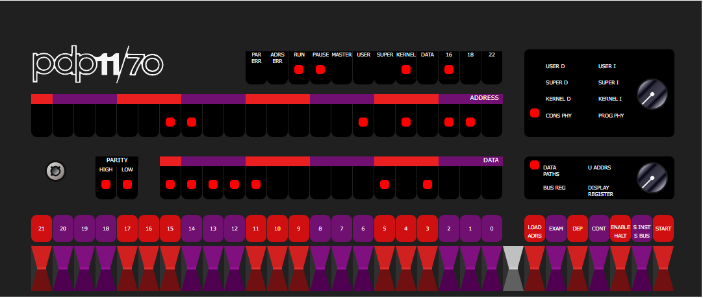

# PDP 11 Emulators in Javascript by Paul Nankervis



This repository contains the code originally written by Paul Nankervis to emulate a number of the PDP 11 series microcomputers by Digital Equipment Corporation (DEC).

The code in this repository originally lived (and continues to live until further notice) on Paul's site located at this address: [https://skn.noip.me/pdp11/pdp11.html](https://skn.noip.me/pdp11/pdp11.html)

Permission was given, by Paul to upload his source code to GitHub. This is the result of that work.

## Live Demo

### With Disk Images

There are two demo's currently live. The first version, complete with all of the original disk images, can be found on Paul's original site: [https://skn.noip.me/pdp11/pdp11.html](https://skn.noip.me/pdp11/pdp11.html)


### Without Disk Images

If you don't think you need access to the disk images, you can access the emulator directly from GitHub Pages, here: [https://jameshagerman.github.io/nankervis-pdp11-js/pdp11.html](https://jameshagerman.github.io/nankervis-pdp11-js/pdp11.html)


## Original notes by Paul Nankervis

Most of the following notes were extracted from Paul's original PDP 11 page. Some formatting issues may exist, and some re-organization may have taken place for clarity. Some links may be broken, but should be working on the original site.

In case things are unclear, be sure to check things on Paul's original site as things may have been lost in translation.

### PDP 11/70 Emulator v1.8   October 2017

This emulator came about because years ago I was a programmer for RSTS/E on a PDP 11/45 and had admired the console idle loop light pattern - but I couldn't quite remember how it looked. Given the unavailability of real systems it became time to write an emulator!

I was going to start with a PDP 11/45 emulator but the extra memory of a PDP 11/70 became far too attractive (a whole 4MB!). It took some time before I finally produced a [PDP 11/45](http://skn.noip.me/pdp11/pdp11-45.html) version.

I have met my core objective - I can now see the RSTS/E console light pattern that I was looking for, and found that newer versions (eg v9.6) have a different light pattern. Also I have now seen some of the light patterns for other OSes. RSX and BSD 2.11 have their own different patterns and Unix V5 and Ultrix operate with absolute minimum light movement (I'm assuming they operates mostly in WAIT mode).

Getting all of the operating systems used here presents its own set of challenges - one of which is finding the software in the first place. But one of the most interesting was RSTS/E V06C which has its own [story](https://skn.noip.me/pdp11/RSTSv06c.html).

Note: The boot code in this emulator is a custom PDP 11 program running with it's own set of light patterns. It is initially loaded at address 140000 and the LIGHTS command operates by mapping a WAIT instruction to different addresses within Supervisor mode. The source for this program can be found in the RT11 operating environment as BOOT.MAC You can use this code to boot one of the guest OSes or use the LIGHTS command and DIAG command to experiment with idle light patterns and load test the CPU.

If you wish to toggle in a simple light chaser to the front panel then here are some switch commands which can be used:

```
Address Data    Code        Switch commands
                            HALT, 001000, LOAD ADDRESS
001000  012700  mov #1,r0   012700, DEPOSIT
001002  000001              000001, DEPOSIT
001004  006100  rol r0      006100, DEPOSIT
001006  000005  reset       000005, DEPOSIT
001010  000775  br .-4      000775, DEPOSIT
                            001000, LOAD ADDRESS, ENABLE, START
```

To restart the initial boot code (if it has not been overwritten) use the switch commands:

```
    	HALT, 140000, LOAD ADDRESS, ENABLE, START
```

If you plan to run the emulator repeatedly or for a project, consider downloading the emulator to your own machine or server. This will significantly speed any of the emulator disk accesses and response times. All files and emulator OS disks can be found in the top level folder of http://skn.noip.me/pdp11/ or in the single zip file http://skn.noip.me/pdp11/pdp11.zip

This emulator matches approximately the following SIMH configuration:

```
  set cpu 11/70 1912K nofpp  !1912K is not actually SIMH legal - use 2M instead
  set clk 50hz
  attach rk0 rk0.dsk	!RK05 image of Unix V5
  attach rk1 rk1.dsk	!RK05 image of RT11 v4.0
  attach rk2 rk2.dsk	!RK05 image of RSTS V06C-03
  attach rk3 rk3.dsk	!RK05 image of XXDP
  attach rk4 rk4.dsk	!RK05 image of RT-11 3B
  attach rk5 rk5.dsk	!RK05 image of RT-11 V5.4F
  set rl0 RL02
  attach rl0 rl0.dsk	!RL02 image of BSD 2.9
  set rl1 RL02
  attach rl1 rl1.dsk	!RL02 image of RSX 11M v3.2
  set rl2 RL01
  attach rl2 rl2.dsk	!RL01 image of RSTS/E v7.0
  set rl3 RL02
  attach rl3 rl3.dsk	!RL02 image of XXDP+
  set rp0 RP06
  attach rp0 rp0.dsk	!RP06 image of ULTRIX-11 V3.1
  set rp1 RP06
  attach rp1 rp1.dsk	!RP06 image of BSD 2.11
  set rp2 RP04
  attach rp2 rp2.dsk	!RP04 image of RSTS/E v9.6
  set rp3 RP04
  attach rp3 rp3.dsk	!RP04 image of RSX 11M v4.6
  attach tm0 tm0.tap	!Backup of RSTS 4B-17
  attach tm1 tm1.tap	!Distribution for RSTS V06C-03
  attach tm2 tm2.tap	!Distribution for RSTS V7.0
```

This emulator then loads in the BOOT.MAC code to location 140000 and begins execution there.
There are many PDP emulators out there and I have never seen what I consider to be a complete list. Some of the really interesting ones can be found by googling terms such as "vhdl pdp 11". However the gold standard seems to be SIMH at [Trailing Edge](http://simh.trailing-edge.com/). A different approach to Javascript PDP 11 emulation can be found at [www.pcjs.org](http://www.pcjs.org/devices/pdp11/).

I believe that the first PDP 11 emulator would be SIM-11 written in FORTRAN before the first PDP 11/20 hardware was even built - see [How the PDP-11 Was Born](http://www.hampage.hu/pdp-11/birth.html). There is more PDP 11 history at [www.hampage.hu](http://www.hampage.hu/pdp-11/main.html).

Of course if you want your own PDP 11/70 front panel you might consider [one of these](https://hackaday.io/project/8069-pidp-11).

Happy emulating!

Paul Nankervis

### List of guest OS's:

*Note: Due to the size of some of these images, they are not included in this GitHub repository themselves. Instead, they can be found on the [Releases](https://github.com/JamesHagerman/nankervis-pdp11-js/releases) page of this repo, or on Paul's original site. If using the Releases version, extract the archive and place the `*.dsk` and `*.tap` files in the `os-images/` directory inside this repository.*

```
Disk	OS	Comment
RK0	Unix V5	Boot using: unix then login as root
RK1	RT11 v4.0	The lightest/fastest OS here
RK2	RSTS V06C-03	Boot and login as 1,2 with password SYSTEM or as 11,70 using PDP
RK3	XXDP	Diagnostic OS and utilities
RK4	RT-11 3B	Distribution for RT-11 Version 3B
RK5	RT-11 V5.4F	Distribution for RT-11 Version 5.4F
TM0	RSTS 4B-17	Boot ROLLIN from TM0 and restore DK0 with "DK:<MT:VIXEN/REW". Reboot from DK0 with "/BO:DK" and login as 1,2 with password SYSTEMor 11,70 using PDP Commands are case sensitive.
RL0	BSD 2.9	Boot using: rl(0,0)rlunix   CTRL/D to get to multiuser
RL1	RSX 11M v3.2	Login as 1,2 with password SYSTEM
RL2	RSTS/E v7.0	Option: <LF> Suboption: <LF> ... Login as 1,2 using SYSTEM or 11,70 using PDP
RL3	XXDP	Larger version of diagnostics - including PDP 11/70 utilities
RP0	ULTRIX-11 V3.1	CTRL/D to enter multiuser mode. Login as root with no password
RP1	BSD 2.11	Will autoboot and enter multiuser mode. Login as root with no password
RP2	RSTS/E v9.6	Answer boot questions and login as 1,2 (password SYSTEM) or 11,70 (no password)
RP3	RSX 11M v4.6	Starts logged in as 1,2 (password SYSTEM) - user accounts 200,1 (no password) or 11,70 (password PDP)
```

Note: Disks are shown in approximately order size. The [RK05](https://en.wikipedia.org/wiki/RK05) disks at the top are small and not too bad to use across a network. The [RP06](http://www.columbia.edu/cu/computinghistory/rp06.html) disks at the bottom can be rather slow.

[Youtube video 1](https://www.youtube.com/watch?v=3Nr1E96tXRU)

[Youtube video 2](https://www.youtube.com/watch?v=F-kJo1DTtw4)

### Bugs?

*Note: This text was originally hidden at the very bottom of Paul's Index. I didn't see it until moving it into this repo, so I moved it here for better visability.*

Plenty! Especially in the places where I haven't managed to figure out what a real PDP 11/70 should do. :-( Core PDP 11/70 stuff is well documented but some lesser used system functions require reverse engineering to understand.

If you have something you want me to look at let me know and I'll prioritise. However always happy to accept fixes!

*Note: Now that this code exists in GitHub, it may be prudent to both follow Paul's original advice and reach out to him, as well as open a GitHub issue. Keep in mind, the later may not be productive...*


### Example Boot logs from the various OS disk images

Originally, these example boot logs were in the `pdp11.html` file. They've been moved to another file in this repo named `ExampleBoots.md`, found [here](ExampleBoots.md).

The examples are seriously work looking through!